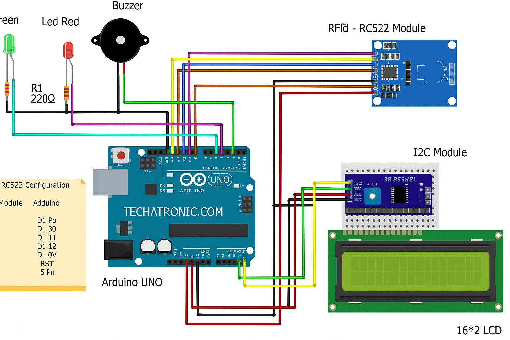

# 📟 RFID Based Attendance System with Arduino

This project demonstrates how to **interface the RFID RC522 module with Arduino UNO** to automate attendance tracking.  
When a registered RFID tag is scanned, the system logs the **student’s name, roll number, date, time, and status** into an **Excel sheet (`rfid_result.xlsm`)** using the **PLX-DAQ** data acquisition tool.

---

## 🧰 Components Required
| Component | Description |
|------------|--------------|
| Arduino UNO | Main microcontroller board |
| RFID RC522 Module | Used for reading RFID tags/cards |
| RFID Tags/Cards | Unique identifiers for each person |
| Jumper Wires | For connections |
| Breadboard *(optional)* | For easy prototyping |
| USB Cable | To connect Arduino to PC |

---

## 🔌 Circuit Diagram

**Connections Between RFID RC522 and Arduino UNO:**

| RFID Pin | Arduino Pin |
|-----------|--------------|
| VCC       | 3.3V         |
| GND       | GND          |
| RST       | 9            |
| MISO      | 12           |
| MOSI      | 11           |
| SCK       | 13           |
| SDA (SS)  | 10           |

---

## 💻 Code Overview

The main Arduino program is located in [`RFID_Excel.ino`](RFID_Excel.ino).

**Key Features:**
1. Initializes the **RFID RC522** module.  
2. Detects RFID cards and reads their **unique UID**.  
3. Verifies whether the card is **registered or unregistered**.  
4. Sends real-time data (Name, Roll No, UID, Date, Time, and Status) to **Excel via Serial** using PLX-DAQ.  
5. Attendance data is automatically saved in **`rfid_result.xlsm`**.

---

## ⚙️ How to Run the Project

1. Open `RFID_Excel.ino` in **Arduino IDE**.  
2. Go to **Tools → Board → Arduino UNO**.  
3. Select the correct **COM Port**.  
4. Click **Upload** to flash the code.  
5. Open **Excel → rfid_result.xlsm → Enable Macros**.  
6. Launch **PLX-DAQ** and connect to the same COM port (9600 baud).  
7. Scan RFID tags — attendance will log in real-time inside the Excel sheet.

---

## 📊 Output (Excel File: `rfid_result.xlsm`)

When a tag is scanned, the following data is recorded in Excel:

| Date | Time | Name | Roll No | Branch | Card UID | Status |
|------|------|------|----------|---------|-----------|---------|
| 06-03-2025 | 7:01:29 PM | Aakash | 2022/B/42 | ECE | E3 82 C2 E4 | Present |
| 06-03-2025 | 7:01:31 PM | Unknown | Unknown | – | 35 C2 33 2 | Not Register |

> 💾 All records are stored automatically in the file **`rfid_result.xlsm`**, which can be reviewed or analyzed later.

## 🔮 Future Enhancements
- Integrate with **Google Sheets** or a **Cloud Database**.  
- Add **Wi-Fi connectivity** using **ESP32/NodeMCU**.  
- Include **LCD Display and Buzzer** feedback.  
- Enable **Admin Panel** for dynamic student registration.  

---

## 🧠 Learning Outcomes
- Understanding of **RFID communication (SPI protocol)**  
- Real-time **Serial data handling**  
- Using **PLX-DAQ for Arduino-Excel integration**  
- Basics of **IoT-based attendance automation**

---

